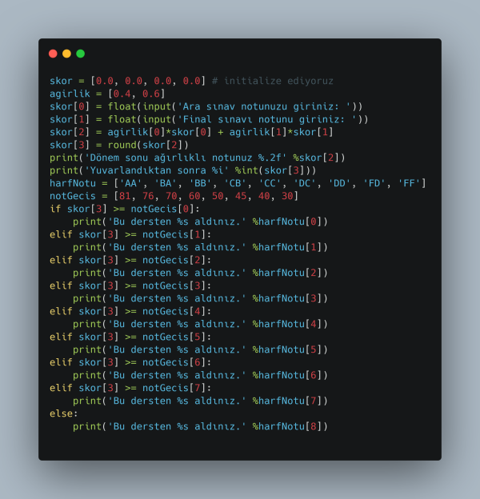

# YENİ BAŞLAYANLAR için PYTHON (PYTHON for BEGINNERS)
## Harf Notu Hesabı (Computation of Letter Grade)
Gümüşhane Üniversitesi'ndeki harf notu hesabı aşağıdaki gibi yapılmaktadır. 
The letter grades at Gumushane University is given as follows:

 

İnteraktif bir şekilde kullanıcıdan vize ve final notunu öğrenip ardından ağırlıklı son notu ve de tekabül eden harf notunu hesaplayan MATLAB ve Python kodları aşağıda verildiği gibidir. 
The MATLAB and Python scripts that interact with the user and return the (weighted) final grade and the corresponding letter grade is shown below.

*if - else koşullu ifadeleriyle Python kodu (videoyu izlemek için resime (koda) tıklayın)*

*for döngüsü ile Python kodu (Python script with for loop)*

## Rasgele Sayı, Dizi ve Matris Üretme ve Üzerinde Dolaşma
Aşağıdaki videoda **numpy** kütüphanesinden **randint()**, **rand()**, **astype()**, **zeros()**, **ones()** komutlarını kullanarak rasgele bir sayı, dizi ve matris üretmeyi öğrenebilirsiniz [2]. Elde edilen matris üzerinde dolaşan ve örnek olarak matrisin sıfıra eşit eleman sayısını bulan kodu da burada bulabilirsiniz. Videoyu izlemek için aşağıdaki resme tıklayın.

## Monitoring Microphone Signal (with FFT plot) in Real-time with Python
Click on the image to watch the video.

### Notlar (Notes)
*streamAudio.py* is written by **Zach Miller**. 
The code is taken from https://github.com/ZWMiller 
I did not ask Zach for permission for uploading his *streamAudio.py* to my own github. The reason for me to upload it here (instead of pointing directly to Zach's repository) is that my students are just beginners in Python so it is very hard for them to go to Zach's account and find the project there. If Zach contacts me for removing the code, I will do it immediately.
### Kaynaklar (References)
[1] https://github.com/ZWMiller/PythonProjects
[2] Generating Random Numbers in Python - https://machinelearningmastery.com/how-to-generate-random-numbers-in-python/
